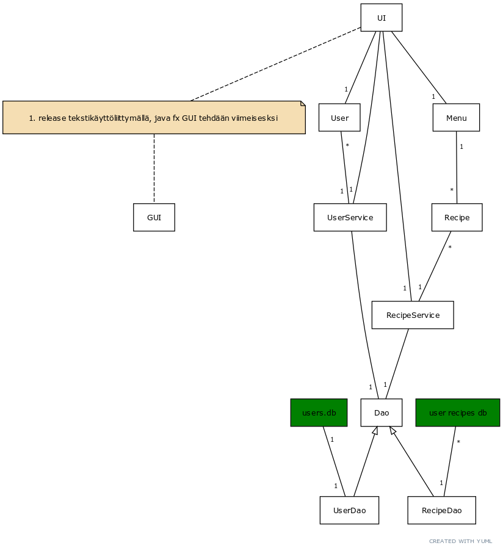
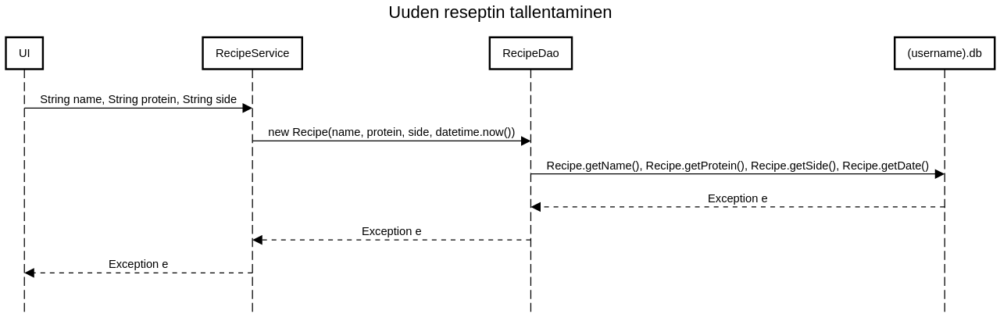

<h1>Arkkitehtuurikuvaus</h1>

Sovellus koostuu kolmesta pakkaustasosta: käyttöliittymä (ui), sovelluslogiikka (domain) ja tietokantayhteyden käsittely (dao). Lisäksi on omana pakkaukseen eriytetty konfiguraatiotiedostoa käsittelevä toiminnallisuus (setup).

Pakkausten väliset suhteet ilmenevät pakkauskaaviosta.

<h2>Pakkauskaavio</h2>

<h2>Luokkakaavio</h2>

<h2>Käyttöliittymä</h2>

<h2>Tietokanta</h2>

Sovellus tallettaa tietoja kahteen tietokantaan. Käyttäjätietokanta (oletusarvona users.db) sisältää käyttäjätunnukset. Kullekin käyttäjälle luodaan oma reseptitietokanta, joka sisältää käyttäjäkohtaiset reseptit ja menun muodostamiseen käytettävät aikaleimat. Tietokantana on käytetty sqlite -tietokantaa ja sitä ohjataan sovelluksessa jdbc -ajurin versiolla 3.38.0.

<h2>Päätoiminnallisuudet</h2>

-käyttäjän lisääminen-
-käyttäjän kirjautuminen-

-reseptin poistaminen-
-menun luominen-

<h2>Konfiguraatiotiedost</h2>

Sovellskansio sisältää konfiguraatiotiedoston .

Tiedostossa määritellään käyttäjätietokannan nimi, oletusarvoisesti uuden käyttäjän käyttöön tulevat pääraaka-aineet ja lisukkeet sekä uuden käyttäjän tietokantaan generoitavat oletusreseptit.

Pääraaka-aineet ja lisukkeet on erotettu pilkuilla

<code>liha,kala,kasvis</code>

ja reseptit pilkuilla mutta siten että jokaista reseptiä kohden on oltava nimi, pääraakaine ja lisukkeet

<code>makaronilaatikko,liha,pasta</code>

<h2>Kehityskohteet</h2>

Käyttäjätietojen ja reseptien erottaminen omiin tietokantoihinsa ei todennäköisesti ole paras mahdollinen ratkaisu. Sovelluksen jatkokehityksessä tulisi yhdistää kaikki tiedot yhteen tietokantaaan jotta se ei generoisi suurta määrää erillisiä käyttäjäkohtaisia tietokantoja.

Konfiguraatiotiedostossa reseptit olisi kannattanut erottaa esim. puolipisteellä niin, ettei yksittäinen puuttuva pilkku johda virheellisesti luettuihin resepteihin, esim.

<code>makaronilaatikko,liha,pasta;kalakeitto,kala,keitto</code>
