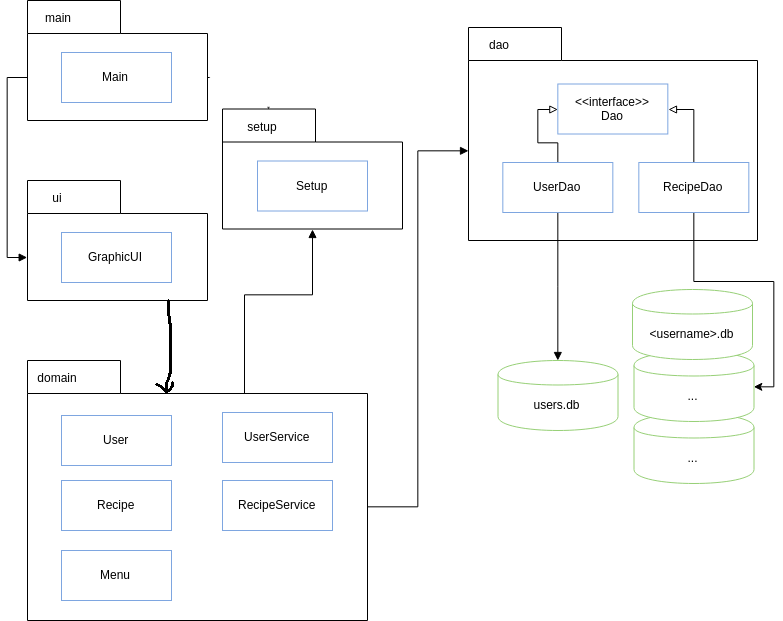
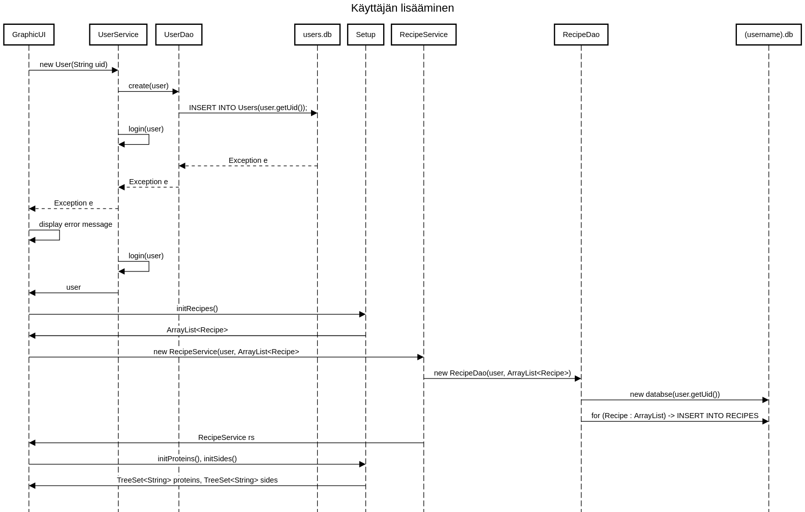

<h1>Arkkitehtuurikuvaus</h1>

Sovellus koostuu kolmesta pakkaustasosta: käyttöliittymä (ui), sovelluslogiikka (domain) ja tietokantayhteyden käsittely (dao). Lisäksi on omana pakkaukseen eriytetty konfiguraatiotiedostoa käsittelevä toiminnallisuus (setup).

Pakkausten väliset suhteet ilmenevät pakkauskaaviosta.

<h2>Pakkauskaavio</h2>

Ohjelman pakkauksissa on eriytetty toisistaan käyttöliitttymä, sovelluslogiikka ja tietokantayhteyttä käsittelevät DAO -luokat. Lisäksi ohjelman sisältää Main -luokan, joka käynnistää sovelluksen käyttöliittymän ja Setup -luokan, joka käsittelee konfiguraatiotiedoston.

<h2>Luokkakaavio</h2>

<h2>Käyttöliittymä</h2>

Käyttöliittymä tarjoaa viisi erilaista näkymää:

- kirjautuminen
- uuden käyttäjän luominen
- päänäkymä
- reseptien lisääminen
- reseptien poistaminen

Näkymät on toteutettu erillisinä metodeina käyttäen Scene -olioita. Reseptien lisääminen ja poistaminen on toteutettu luomalla uusi Stage -olio, jotta näkymä avautuu päänäkymän oheen. Käyttöliittymä on toteutettu luokassa [GraphicUI](../Menuplanner/src/main/java/ohte/ui/GraphicUI).

Käyttöliittymä alustaa ohjelman tarvitsemat tiedot luokan [Setup](../Menuplanner/src/main/java/ohte/setup/Setup.java) avulla ja kutsu parametrien avulla pakkauksen [domain](../Menuplanner/src/main/java/ohte/domain) luokkia.

<h2>Tietokanta</h2>

Sovellus tallettaa tietoja kahteen tietokantaan. Käyttäjätietokanta (oletusarvona users.db) sisältää käyttäjätunnukset. Kullekin käyttäjälle luodaan oma reseptitietokanta, joka sisältää käyttäjäkohtaiset reseptit ja menun muodostamiseen käytettävät aikaleimat. Tietokantana on käytetty sqlite -tietokantaa ja sitä ohjataan sovelluksessa jdbc -ajurin versiolla 3.38.0.

<h2>Päätoiminnallisuudet</h2>

Ohjelman päätoiminnallisuudet on kuvattu sekvenssikaavioilla.

<h3>Kirjautuminen</h3>

Ohjelmaan voidaan kirjautua joko olemassaolevalla käyttäjätunnuksella tai luoda uusi käyttäjä. Sisäänkirjautumisikkunan avautuessa käyttöliittymä luo UserService -olion, joka kommunikoi UserDao -luokan kautta käyttäjätietokannan kanssa. UserService -puolestaan luo uuden käyttäjätietokannan jos konfiguraatiossa määritellyn nimistä tietokantaa ei vielä ole sovelluksen juurikansiossa.

<h3>Käyttäjän lisääminen</h3>

Käyttäjää lisätessä ohjelma ensin tarkistaa ettei samannimistä käyttäjää jo ole tietokannassa ja ettei sinne yritetä tallentaa käyttäjänimeksi tyhjää tekstikenttää. Mikäli samannimistä käyttäjää ei ole, luodaan uusi käyttäjä ja kirjataan se sisään ohjelmaan.

<h3>Käyttäjän kirjautuminen</h3>

Käyttäjän kirjautuessa ohjelma luo RecipeService -olion, joka puolestaan joko luo käyttäjän nimellä olevan tietokannan jos sellaista ei jo ole.

<h3>Uuden reseptin tallentaminen</h3>

Ennen uuden reseptin tallentamista ohjelma pyytää käyttäjää tarkistamaan että resepti voidaan lisätä. Tämä estää usean samannimisen reseptin lisäämisen tietokantaan. Mikäli tietokantahaku reseptin toivotulla nimellä palauttaa jonkin muun arvon kuin 'null', voidaan resepti tallettaa tietokantaan 'Lisää resepti' -painikkeella. Uuden reseptin päivämääräksi asetetaan '01-01-1900 00:00:xx', missä xx on satunnaisluku. Tällä varmistetaan että viimeisimmäksi lisätyt reseptit päätyvät todennäköisemmin mukaan seuraavaan generoituun ruokalistaan.

<h3>Reseptin poistaminen</h3>

Reseptin poistaminen tapahtuu valitsemalla listasta poistettava resepti. Lista päivittyy poistamisen yhteydessä.

<h3>Menun generoiminen</h3>

Ruokalista generoidaan Menu -olion generate -metodilla. Metodi hakee tietokannasta listan resepteistä lajiteltuna päivämäärän mukaan ja asettaa sen hajautustauluun jossa avaimena käytetään lisukkeita ja arvoina ArrayDeque -tietorakenteella olevaa pinoa. Metodi käy läpi hajautustaulua ja valikoi reseptejä niin ettei kahta samaa lisuketta tule vierekkäisille päiville.

Generoinnin yhteydessä kutsutaan myös updateUsedRecipes -metodia, joka päivittää tietokantaan ruokalistalle päätyneiden reseptien päivämääräksi sen hetkisen päivämäärän käyttäen Javan LocalDateTime.now() -metodia.

<h2>Konfiguraatiotiedosto</h2>

Sovelluskansion tulee sisältää konfiguraatiotiedoston [config.properties](../Menuplanner/config.properties). Tiedosto on ladattavissa releasen yhteydessä.

Tiedostossa määritellään käyttäjätietokannan nimi, oletusarvoisesti uuden käyttäjän käyttöön tulevat pääraaka-aineet ja lisukkeet sekä uuden käyttäjän tietokantaan generoitavat oletusreseptit. Tiedosto tukee UTF-8 merkistöä, joten teksteissä voi esiintyä ääkkösiä.

Pääraaka-aineet ja lisukkeet on erotettu pilkuilla

<code>liha,kala,kasvis</code>

ja reseptit pilkuilla mutta siten että jokaista reseptiä kohden on oltava nimi, pääraakaine ja lisukkeet

<code>makaronilaatikko,liha,pasta</code>

<h2>Kehityskohteet</h2>

Käyttäjätietojen ja reseptien erottaminen omiin tietokantoihinsa ei todennäköisesti ole paras mahdollinen ratkaisu. Tietojen yhdistäminen samaan tietokantaan niin, että jokaiselle käyttäjälle näkyisivät vain hänen omat reseptinsä ja että resepteille olisi ylläpidetty käyttäjäkohtaisia tietoja siitä milloin niitä on viimeksi käytetty osana ruokalistaa, olisi kuitenkin vaatinut useampia tietokantatauluja ja monimutkaisempaa tietokannan rakennetta.Päädyi yksinkertaisuuden vuoksi kahden tietokannan ratkaisuun. Sovelluksen jatkokehityksessä tulisi yhdistää kaikki tiedot yhteen tietokantaaan jotta se ei generoisi suurta määrää erillisiä käyttäjäkohtaisia tietokantoja.

Konfiguraatiotiedostossa reseptit olisi kannattanut erottaa esim. puolipisteellä niin, ettei yksittäinen puuttuva pilkku johda virheellisesti luettuihin resepteihin, esim.

<code>makaronilaatikko,liha,pasta;kalakeitto,kala,keitto</code>

DAO -luokkiin on jäänyt reseptitietojen päivittämisen osalta turhaa koodia, koska tässä toteutuksessa respeteistä päivittyvä vain date -kentät. Alkuperäisenä ajatuksena oli, että käyttäjä voisi muokata tarvittaessa reseptien kaikkia tietoja mutta tämä toiminnallisuus jätettiin toteuttamatta ja siirrettiin jatkokehitysideoihin.
