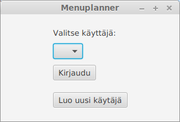

<h1>Käyttöohje</h1>

Lataa Menuplanner jar -tiedosto ja config.properties konfiguraatiotedosto .

<h2>Konfigurointi</h2>

Ohjelma tarvitsee toimiakseen config.properties nimisen tiedoston, josta se luke käyttäjätietokannan nimen ja yksittäisten käyttäjien käyttöön tulevat pääraaka-aineet, lisukkeet ja oletusreseptit. Tiedoston muoto on

```
usersDataBase = users
proteins = liha,kala,kasvis jne.
sides = pasta,riisi,peruna jne.
recipes = makaronilaatikko,liha,pasta,kalakeitt,kala,keitto</code>
```

<h2>Käynnistäminen</h2>

Ohjelma käynnistetään komennolla

<code>java -jar Menuplanner***.jat</code>

<h2>Kirjautuminen</h2>

Sovelluksen käynnistyessä vaihtoehtoina on valita listasta olemassa oleva käyttäjä tai luoda uusi käyttäjä.



Kirjautuminen tapahtuu valitsemalla dropbx -valikosta käyttäjä ja klikkaamalla 'Kirjaudu' -painiketta.
