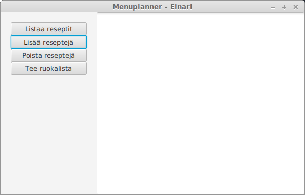

<h1>Käyttöohje</h1>

Lataa Menuplanner jar -tiedosto ja config.properties konfiguraatiotedosto releases -kansiosta.

<h2>Konfigurointi</h2>

Ohjelma tarvitsee toimiakseen config.properties nimisen tiedoston, josta se luke käyttäjätietokannan nimen ja yksittäisten käyttäjien käyttöön tulevat pääraaka-aineet, lisukkeet ja oletusreseptit. Tiedoston muoto on

```
usersDataBase = users
proteins = liha,kala,kasvis jne.
sides = pasta,riisi,peruna jne.
recipes = makaronilaatikko,liha,pasta,kalakeitt,kala,keitto
```

<h2>Käynnistäminen</h2>

Mikäli olet ladannut koneellesi valmiiksi paketoidun .jar -tiedoston, käynnistetään ohjelma komennolla

<code>java -jar Menuplanner.jar</code>

Jos haluat käynnistää ohjelman lähdekoodista rakentamalla, voit ajaa Menuplanner -kansiossa käynnistysskriptin

<code>./kaynnista</code>

<h2>Kirjautuminen</h2>

Sovelluksen käynnistyessä vaihtoehtoina on valita listasta olemassa oleva käyttäjä tai luoda uusi käyttäjä.


Kirjautuminen tapahtuu valitsemalla pudotusvalikosta käyttäjä ja klikkaamalla 'Kirjaudu' -painiketta.

<h2>Uuden käyttäjän luominen</h2>

Uusi käyttäjä luodaan valitsemalla kirjautumisnäkymässä 'Luo uusi käyttäjä'. Avautuvassa ikkunassa kirjoitetaan uuden käyttäjän nimi ja valitaan 'Luo uusi käyttäjä'. Kannassa ei voi olla samannimisiä käyttäjiä, sovellus antaa virheilmoituksen jos uuden käyttäjän lisääminen ei onnistu.


<h2>Päänäkymä</h2>



Päänäkymässä valitaan haluttu toiminnallisuus painamalla vasemmassa laidassa olevaa painiketta.

<h2>Tietokannassa olevien reseptien listaaminen</h2>


Listaa reseptit -painike näyttää tietokannassa olevat reseptit. Listassa ylimpänä ovat uusimmat reseptit.

<h2>Uuden reseptin lisääminen</h2>

Lisää reseptejä -painikkeella pääsee reseptien lisäämisnäkymään.


Pudotusvalikoista valitaan lisättävän reseptin pääraaka-aine ja lisuke, tekstikenttään kirjoitetaan uuden reseptin nimi. Tämän jälkeen painetaan Tarkista -painiketta. Sovellus tarkistaa onko samanniminen resepti jo tietokannassa. Jos reseptiä ei löydy tietokannasta, tulee näkyviin Lisää resepti -painike, jolla resepti tallennetaan tietokantaan.


Päänäkymään palataan klikkaamalla Palaa -painiketta.

<h2>Reseptin poistaminen</h2>

Poista reseptejä -painikkeella pääsee reseptien poistamisnäkymään.


Poistettava resepti valitaan pudotusvalikosta ja se poistetaan klikkaamalla Poista resepti -painiketta.

Päänäkymään palataan klikkaamalla Palaa -painiketta.

<h2>Ruokalistan generoiminen</h2>

Tee ruokalista -painike generoi arkiviikon ruokalistan.


Mikäli tietokannassa on vähemmän kuin viisi reseptiä, ei ruokalistaa voida generoida. Sovellus ilmoittaa tästä viestillä.

<h2>Sovelluksesta poistuminen</h2>

Sovelluksesta poistutaan klikkaamalla sovellusikkunan yläreunassa oikealla olevaa ruksia.
