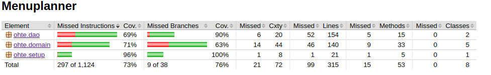

<h1>Testausdokumentti</h1>

Ohjelmaa on testattu JUnitilla automatisoiduin testein sekä manuaalisesti. Käyttöliittymän toiminta on testattu ainoastaan manuaalisesti ja niitä ei ole laskettu testikattavuusraportteihin mukaan.

<h2>JUnit -testit</h2>

<h3>Sovelluslogiikka (domain)</h3>

Testiluokat on jaoteltu pakkauksen [ohte.domain](../Menuplanner/src/main/java/ohte/domain) sisällön mukaisesti.

[UserTest](../Menuplanner/src/test/java/UserTest.java) ja [RecipeTest](../Menuplanner/src/test/java/RecipeTest.java) testaavat että niille generoiduille olioille muodostuvat oikeat parametrien mukaiset muuttujat.

Vastaavasti [UserServiceTest](../Menuplanner/src/test/java/UserServiceTest.java) ja [RecipeServiceTest](../Menuplanner/src/test/java/RecipeServiceTest.java) testaavat näiden luokkien keskeiset ominaisuudet eli tiedon välittämisen käyttöjärjestelmän ja DAO-luokkien välillä. DAO -luokkien testaaminen sisältyy näihin testeihin, niille ei ole rakennettu omia testiluokkia.

Testiluokka [MenuTest](../Menuplanner/src/test/java/MenuTest.java) testaa menun generoimisen oikeellisuuden.

<h3>DAO</h3>

Testiluokka generoi dao -luokkia [UserDao](../Menuplanner/src/main/java/ohte/dao/UserDao.java) ja [RecipeDao](../Menuplanner/src/main/java/ohte/dao/RecipeDao.java) käyttävien metodien testaamista varten testitietokannat, jotka poistetaan automaattisesti testiajon päätyttyä.

Testiluokka generoi dao -luokkien [UserDao](../Menuplanner/src/main/java/ohte/dao/UserDao.java) testaamista varten testitietokannat, jotka poistetaan automaattisesti testiajon päätyttyä.

<h3>Konfiguraatiotiedoston käsitteleminen (setup)</h3>

Testiluokka [SetupTest](../Menuplanner/src/test/java/SetupTest.java) testaa konfiguraatiotiedoston käsittelelmistä. Se generoi testikäyttöön test.properties -nimisen tiedoston joka poistetaan automaattisesti testiajon päätteeksi.

Testiluokkaa testaa että konfiguraatiotiedoston tieto luetaan oiken ja siitä generoituvat sovelluksen käyttämät pääraaka-aineiden, lisukkeiden ja reseptien listat.

<h3>Testauskattavuus</h3>

Käyttöliittymä ja main on jätetty testauskattavuuden ulkopuolelle. Main -luokan ainoa toiminnallisuus on käyttöliittymän käynnistäminen.

Testaamatta jää menun generoinnissa tilanne, jossa reseptejä ei ole riittävästi sekä uuden menun reseptien päivittyminen tieokantaan. Manuaalinen testaaminen osoittaa, että reseptien päivämäräärät tietokannassa päivittyvät. Myös joitakin konstruktorien poikkeustilanteita ja poikkeusten käsittelyjä (catch) jää testauskattavuuden ulkopuolelle.

<h2>Järjestelmätestaus</h2>

<h3>Asennus ja konfigurointi</h3>

Ladattu ja testattu Linux -ympäristössä fuksiläppärillä (Cubbli Linux), ssh -yhteydellä melkki.cs.helsinki.fi ja virtuaalityöasemassa VDI.

Sovellusta testatessa on käyty läpi sekä tilanne, jossa suorituskansiossa ei ole tarvittavia tietokantatiedostoja jolloin sovellus generoi ne, että tilanne jossa tietokantatiedostot ovat kansiossa valmiina.

<h3>Toiminnallisuudet</h3>

Kaikki [määrittelydokumentin](vaatimusmärittely.md) ja [käyttöohjeen](kayttoohje.md) listaamat toiminnallisuudet on käyty läpi manuaalisesti ja automaattisin testein.

<h3>Käyttöliittymä</h3>

Käyttöliittymää on testattu manuaalisesti käymällä järjestelmällisesti läpi eri toiminnot ja syöttämällä niihin sekä sallittuja että tyhjiä syötteitä.

<h2>Sovellukseen jääneet ongelmat</h2>

Jos tietokannassa on alle 5 reseptiä, sovellus generoi tyhjän ruokalistan ja ilmoittaa ettei ruokalistaa voi generoida.
